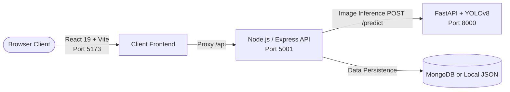

# 🦟 DengueGuard AI - Dengue Prevention & Risk Assessment System

An intelligent full-stack system designed to detect dengue breeding sites using computer vision (YOLO), streamline citizen reporting, and empower Public Health Inspectors (PHIs) and administrators to manage eradication workflows efficiently.

---

## 🏗️ Architecture Overview

The system consists of three core components running concurrently:



| Component | Technology | Directory | Default Port / URL |
| :--- | :--- | :--- | :--- |
| **Frontend** | React 19, Vite, Tailwind CSS | `client/` | `http://localhost:5173` |
| **Backend API** | Node.js, Express, Mongoose | `Server/` | `http://localhost:5001` |
| **AI Service** | Python, FastAPI, YOLOv8 (Ultralytics) | `ai-service/` | `http://localhost:8000` |
| **AI Swagger Docs**| FastAPI OpenAPI Docs | `ai-service/` | `http://localhost:8000/docs` |

---

## 📋 Prerequisites

Before running the project, ensure you have the following installed on your machine:

- **Node.js**: `v18.x` or higher (includes `npm`)
- **Python**: `3.9` - `3.12`
- **Git**
- *(Optional)* **MongoDB**: If not installed/running, the backend will automatically fall back to its built-in local JSON file storage (`Server/src/data/`).

---

## 🚀 How to Run the Full Project

To run the complete system, open **three separate terminal windows** (one for each service).

### 1️⃣ Step 1: Start the AI Service (FastAPI)

The AI service uses YOLO to detect dengue breeding vectors (tires, discarded containers, drain inlets, coconut shells, bottles) and calculates risk levels.

1. Open a terminal and navigate to `ai-service`:
   ```bash
   cd ai-service
   ```

2. Activate or create a Python virtual environment:
   - **Windows (PowerShell)**:
     ```powershell
     # If .venv exists:
     ..\.venv\Scripts\Activate.ps1
     # OR create a new one:
     python -m venv .venv
     .venv\Scripts\Activate.ps1
     ```
   - **Windows (Command Prompt - CMD)**:
     ```cmd
     ..\.venv\Scripts\activate.bat
     # OR
     .venv\Scripts\activate.bat
     ```
   - **macOS / Linux**:
     ```bash
     python3 -m venv .venv
     source .venv/bin/activate
     ```

3. Install required Python packages:
   ```bash
   pip install -r requirements.txt
   ```

4. Verify model file:
   Ensure `models/best.pt` exists in `ai-service/models/best.pt`.

5. Start the FastAPI server:
   ```bash
   python main.py
   ```
   *Alternatively:*
   ```bash
   uvicorn main:app --reload --host 0.0.0.0 --port 8000
   ```
   ✅ AI service will be live at: **`http://localhost:8000`** (Docs at `http://localhost:8000/docs`).

---

### 2️⃣ Step 2: Start the Backend API (Node.js & Express)

1. Open a second terminal and navigate to `Server`:
   ```bash
   cd Server
   ```

2. Install dependencies:
   ```bash
   npm install
   ```

3. *(Optional)* Configure Environment Variables:
   Create a `.env` file in the `Server` directory if you wish to override default settings:
   ```env
   PORT=5001
   NODE_ENV=development
   JWT_SECRET=your_jwt_secret_key
   JWT_EXPIRES_IN=7d
   CORS_ORIGIN=http://localhost:5173
   MONGO_URI=mongodb://localhost:27017/dengueguard
   SEED_PASSWORD=demo1234
   ```
   > **Note:** If MongoDB is not running locally, the server logs a warning and automatically uses local JSON database files stored under `Server/src/data/`.

4. Seed the initial database with demo users, areas, and reports:
   ```bash
   npm run seed
   ```

5. Start the backend development server:
   ```bash
   npm run dev
   ```
   ✅ Backend API will be live at: **`http://localhost:5001`**.

---

### 3️⃣ Step 3: Start the Frontend Client (React & Vite)

1. Open a third terminal and navigate to `client`:
   ```bash
   cd client
   ```

2. Install dependencies:
   ```bash
   npm install
   ```

3. Start the Vite development server:
   ```bash
   npm run dev
   ```

4. Open your browser and navigate to:
   👉 **`http://localhost:5173`**

---

## 🔑 Demo Login Accounts

After running `npm run seed` in the `Server` folder, the following test accounts are ready for use:

| Role | Email | Password | Description |
| :--- | :--- | :--- | :--- |
| **Citizen** | `citizen@dengueguard.lk` | `demo1234` | Report breeding spots, upload photos for AI risk assessment, view report history. |
| **Public Health Inspector (PHI)** | `phi@dengueguard.lk` | `demo1234` | Review assigned reports, conduct inspections, update status, and manage visits. |
| **Administrator** | `admin@dengueguard.lk` | `demo1234` | View system analytics, breeding hotspot distribution, manage users & system settings. |

---

## 🧪 Testing the AI Detection Flow

1. Log in as a **Citizen** (`citizen@dengueguard.lk` / `demo1234`).
2. Go to **Report Breeding Site** / **AI Scan**.
3. Upload an image containing potential dengue breeding containers (e.g. discarded tires, uncovered water buckets, drains, flower vases).
4. The client forwards the image via the backend to the FastAPI AI service (`http://localhost:8000/predict`).
5. The model analyzes the image and returns detected objects, confidence levels, and an overall risk score (`High`, `Medium`, or `Low`).
6. Submit the report to send it to the PHI dashboard for inspection.

---

## 🛠️ Common Troubleshooting

### 1. PowerShell Script Execution Error (`Activate.ps1 cannot be loaded`)
If Windows blocks Python virtual environment activation scripts:
```powershell
Set-ExecutionPolicy -ExecutionPolicy RemoteSigned -Scope CurrentUser
```

### 2. AI Service: `Model file not found`
Ensure the trained YOLO weights file is placed at:
```
ai-service/models/best.pt
```

### 3. Port Conflicts
If port `5001`, `5173`, or `8000` is already in use:
- **Backend**: Set `PORT=5002` in `Server/.env` and update `VITE_API_PROXY` in `client/vite.config.js`.
- **AI Service**: Specify another port when launching uvicorn: `--port 8001`, and update the endpoint in `Server/src/controllers/aiController.js`.
