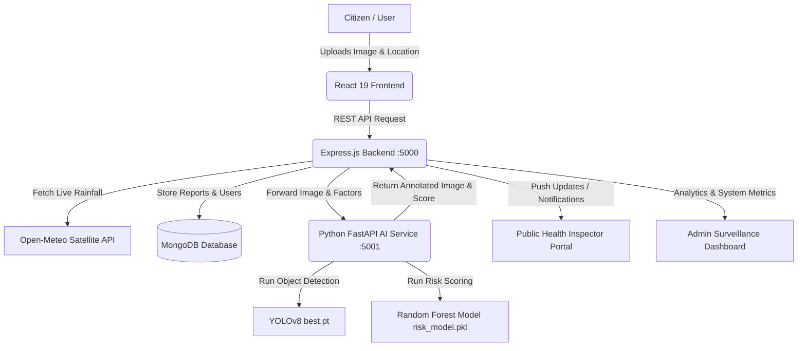

# 🦟 DengueGuard: AI-Powered Dengue Prevention & Surveillance System

[](https://react.dev/)
[](https://nodejs.org/)
[](https://fastapi.tiangolo.com/)
[](https://github.com/ultralytics/ultralytics)
[](https://scikit-learn.org/)
[](https://www.mongodb.com/)

**DengueGuard** is an end-to-end intelligent public health surveillance and hazard management platform designed to control and mitigate dengue outbreaks. It bridges community-driven hazard reporting with automated **Computer Vision** (YOLOv8) and **Multi-Factor Risk Prediction** (Random Forest ML) to empower citizens, Public Health Inspectors (PHIs), and health administrators.

---

## 📌 Key System Features

### 1. 🤖 Two-Stage AI Hazard Assessment
- **Stage 1: Object Detection (YOLOv8)**:
  - Custom-trained computer vision model identifies common Aedes mosquito breeding containers (`Tire`, `Coconut-Exocarp`, `Drain-Inlet`, `Vase`, `Bottle`).
  - Generates real-time bounding box overlays and detection confidence scores.
- **Stage 2: Multi-Factor Risk Scoring (Random Forest)**:
  - Fuses visual severity with real-world contextual parameters:
    1. **Visual Severity Score** ($0 - 100$) derived from detected object hazards.
    2. **AI Detection Confidence** ($0 - 100\%$).
    3. **Live 7-Day Rainfall** (Automated retrieval via Open-Meteo radar/satellite API).
    4. **NDCU Historical District Dengue Cases** (Surveillance registry data).
    5. **Neighborhood Report Density** (Spatial concentration within 2 km radius).
  - Categorizes risk into **Low**, **Medium**, or **High** and outputs an exact continuous risk index ($0.0 - 100.0$).

### 2. 👥 Role-Based Portals

#### 🏠 Citizen Portal
- **Smart GPS Hazard Submission**: Auto-detects device coordinates, pinpoints location on interactive map, and eliminates address typing errors.
- **Instant AI Triage**: Upload photos of potential water receptacles and receive instantaneous hazard detection with prevention advice.
- **Complaint Tracking**: Monitor the live resolution lifecycle of filed reports.
- **Community Hotspot Map**: View localized dengue risk levels and active reports in the surrounding neighborhood.

#### 🩺 Public Health Inspector (PHI) Portal
- **Inspection Management**: Filter, prioritize, and investigate verified high-risk breeding sites.
- **Visual Triage Tool**: Switch between raw photos and YOLO bounding-box detection overlays.
- **Interactive Field Map**: View assigned district sites and log inspection visit outcomes.
- **Official Report Exports**: Generate downloadable **PDF**, **Excel (.xlsx)**, and **CSV** inspection reports with live date/status filters.

#### 🛡️ Administrator Panel
- **System Health Monitor**: Live tracking of the Express backend and Python AI microservice.
- **AI Accuracy & Analytics**: Performance statistics on visual detection confidence and environmental risk trends.
- **User & PHI Management**: Oversee inspector assignments, registered citizens, and account statuses.

---

## 🏗️ System Architecture


```mermaid
graph TD
    A[Citizen / User] -->|Uploads Image & Location| B(React 19 Frontend)
    B -->|REST API Request| C(Express.js Backend :5000)
    C -->|Fetch Live Rainfall| D[Open-Meteo Satellite API]
    C -->|Store Reports & Users| E[(MongoDB Database)]
    C -->|Forward Image & Factors| F(Python FastAPI AI Service :5001)
    F -->|Run Object Detection| G[YOLOv8 best.pt]
    F -->|Run Risk Scoring| H[Random Forest Model risk_model.pkl]
    F -->|Return Annotated Image & Score| C
    C -->|Push Updates / Notifications| I[Public Health Inspector Portal]
    C -->|Analytics & System Metrics| J[Admin Surveillance Dashboard]
```

---

## 📂 Repository Structure

```
ai-dengue-prevention-system/
├── README.md                  # Primary project overview and execution instructions
├── client/                    # Frontend Application (React 19, Vite, Tailwind CSS)
│   ├── .env.example           # Frontend environment variable template
│   ├── package.json           # Client package manifests and scripts
│   ├── src/
│   │   ├── components/        # 3D Mosquito model, UI components, Leaflet/Maps, Charts
│   │   ├── pages/             # Citizen, PHI, Admin, and Auth page views
│   │   ├── routes/            # Role-protected route definitions
│   │   └── services/          # Axios API clients
│   └── vite.config.js
└── Server/                    # Backend API & AI Microservice
    ├── .env.example           # Server environment variable template
    ├── package.json           # Server scripts and dependencies
    ├── server.js              # Express application entrypoint
    ├── ai_model/              # AI / ML Microservice (FastAPI, YOLO, Scikit-Learn)
    │   ├── ai_service.py      # FastAPI service exposing /predict, /retrain, /health
    │   ├── best.pt            # Custom-trained YOLOv8 PyTorch model weights
    │   ├── dengue_data.csv    # Multi-factor training dataset
    │   ├── requirements.txt   # Python dependencies
    │   ├── risk_model.pkl     # Pre-trained Random Forest model bundle
    │   ├── test_prediction.py # Standalone verification test script
    │   └── train_rf.py        # Random Forest model training pipeline
    └── src/
        ├── controllers/       # Business logic controllers (AI, PHI, Citizen, Admin)
        ├── models/            # Mongoose schemas (User, Report, Visit, Prediction)
        └── routes/            # Express route endpoints
```

---

## 💻 Prerequisites

Ensure you have the following software installed on your machine:
- **Node.js** (v18.x or v20.x recommended) & **npm**
- **Python** (v3.9 to v3.12 recommended)
- **MongoDB** (Local instance running on `mongodb://localhost:27017` or MongoDB Atlas URI)

---

## ⚡ Step-by-Step Setup & How to Run

### Step 1: Clone the Repository
```bash
git clone https://github.com/Dilshan74/ai-dengue-prevention-system.git
cd ai-dengue-prevention-system
```

---

### Step 2: Configure Environment Variables

1. **Backend Configuration**:
   ```bash
   cd Server
   cp .env.example .env
   ```
   *(Review `.env` to verify your `PORT=5000` and `MONGO_URI=mongodb://localhost:27017/dengueguard`).*

2. **Frontend Configuration**:
   ```bash
   cd ../client
   cp .env.example .env
   ```
   *(Verify `VITE_API_URL=http://localhost:5000/api`).*

---

### Step 3: Run the Python AI Microservice

In a new terminal window:
```bash
cd Server/ai_model

# (Optional) Create virtual environment
python -m venv venv
# Windows:
.\venv\Scripts\activate
# macOS/Linux:
source venv/bin/activate

# Install AI dependencies
pip install -r requirements.txt

# Start AI inference service
python ai_service.py
```
> The AI microservice will start on **`http://127.0.0.1:5001`**. You can verify it at `http://127.0.0.1:5001/health`.

---

### Step 4: Run the Backend Server (Node.js & Express)

In a new terminal window:
```bash
cd Server

# Install Node.js dependencies
npm install

# Seed demo users and mock inspection data (Optional but recommended)
npm run seed

# Start the Express server
npm run dev
```
> The backend server will start on **`http://localhost:5000`**.

---

### Step 5: Run the Frontend Client (React & Vite)

In a new terminal window:
```bash
cd client

# Install React dependencies
npm install

# Start Vite development server
npm run dev
```
> Open your browser and navigate to **`http://localhost:5173`**.

---

## 🔑 Default Demo Accounts

If you execute `npm run seed`, the following pre-configured demo credentials are created for evaluation:

| Role | Email | Password | Access & Features |
| :--- | :--- | :--- | :--- |
| **Citizen** | `citizen@dengueguard.lk` | `demo1234` | Report hazards, AI image triage, track complaints, community risk map |
| **Public Health Inspector (PHI)** | `phi@dengueguard.lk` | `demo1234` | View assigned reports, toggle YOLO vs raw photo, export PDF/Excel |
| **Administrator** | `admin@dengueguard.lk` | `demo1234` | System health check, AI accuracy stats, user & PHI management |

*(The login screen also provides convenient one-click role selector buttons).*

---

## 🧪 Testing the AI Pipeline

You can verify the machine learning model independently without the frontend:
```bash
cd Server/ai_model
python test_prediction.py
```
This evaluates clean, moderate, and critical hazard test scenarios against `risk_model.pkl` and confirms model output accuracy.

---

## 🛠️ Technology Stack Summary

| Layer | Technologies Used |
| :--- | :--- |
| **Frontend** | React 19, Vite, Tailwind CSS, Lucide React, Three.js (3D Mosquito), Recharts, Leaflet |
| **Backend** | Node.js, Express, MongoDB, Mongoose, JWT, Multer, PDFKit, ExcelJS, Cheerio |
| **AI / Machine Learning** | Python 3, FastAPI, Uvicorn, YOLOv8 (Ultralytics, PyTorch), Scikit-Learn, OpenCV, Pandas, NumPy, Joblib |
| **External APIs** | Open-Meteo Satellite/Weather Radar API, NDCU National Dengue Surveillance Registry |

---

## 📄 License
This project is developed for educational and public health research purposes under the MIT License.
